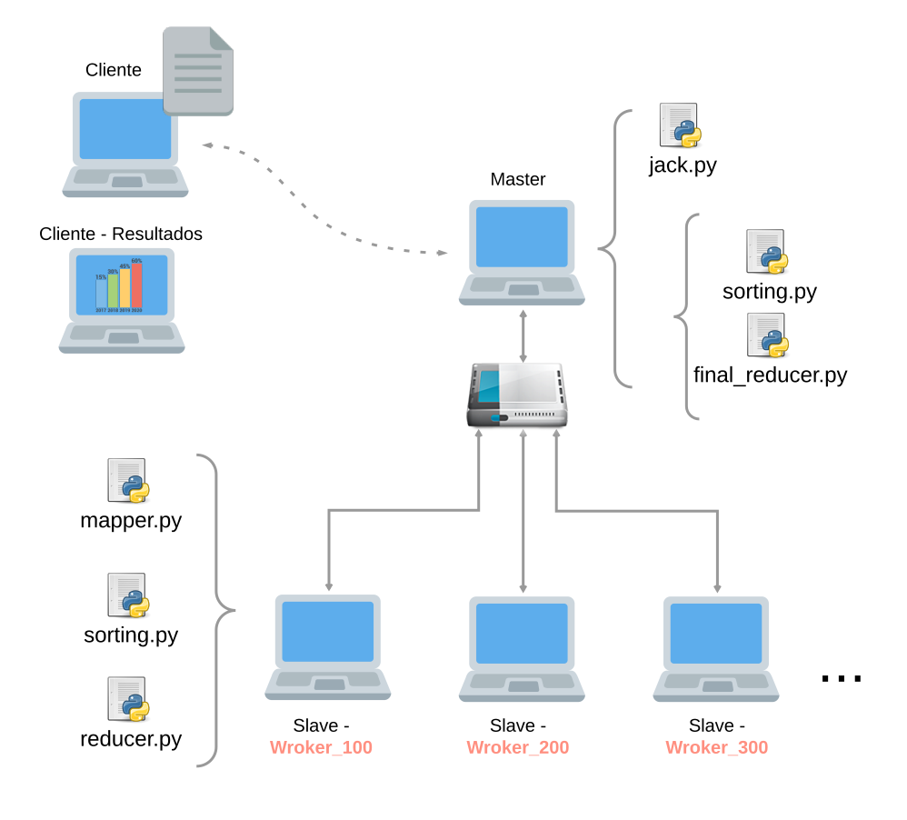

# Sistemas Distribuídos
Segundo Tanenbaum, um sistema distribuído é um conjunto de computadores independentes entre si (e até diferentes), ligados através de uma rede de dados, que se apresentam aos utilizadores como um sistema único e coerente.
## Exemplos:
- Sistemas de pesquisas (motores de busca)
- Sistemas financeiros
- Jogos Online
- Redes Sociais e plataformas idênticas

# Cluster
### O que é cluster?
Cluster (ou clustering) é, em poucas palavras, o nome dado a um sistema que relaciona dois ou mais computadores para que estes trabalhem de maneira conjunta no intuito de processar uma tarefa. Estas máquinas dividem entre si as atividades de processamento e executam este trabalho de maneira simultânea.

Cada computador que faz parte do cluster recebe o nome de nó (ou node). Teoricamente, não há limite máximo de nós, mas independentemente da quantidade de máquinas que o compõe, o cluster deve ser "transparente", ou seja, ser visto pelo usuário ou por outro sistema que necessita deste processamento como um único computador.

Os nós do cluster devem ser interconectados, preferencialmente, por uma tecnologia de rede conhecida, para fins de manutenção e controle de custos, como a Ethernet. É extremamente importante que o padrão adotado permita a inclusão ou a retirada de nós com o cluster em funcionamento, do contrário, o trabalho de remoção e substituição de um computador que apresenta problemas, por exemplo, faria a aplicação como um todo parar.

[Fonte] Mateus (https://www.infowester.com/cluster.php)

## Cluster Computer - MapReduce
Arquitetura e estruturação do sistema - Cluster de processamento de texto em grandes volumes (BigData), modelo mapReduce - WordCount example.

## Segurança
		
Para gerenciar os arquivos entre cada node do cluster, será utilizado a criptpgrafia em base64 e a compactação da **hash_string** para garantir segurança e menores quantidades de dados em bytes trafegando na rede via sockets, possibilitando uma comunicação mais rápido de node para node.

