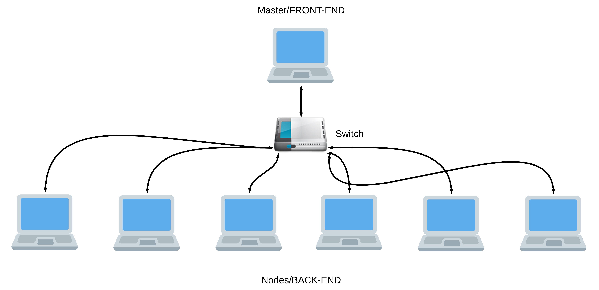
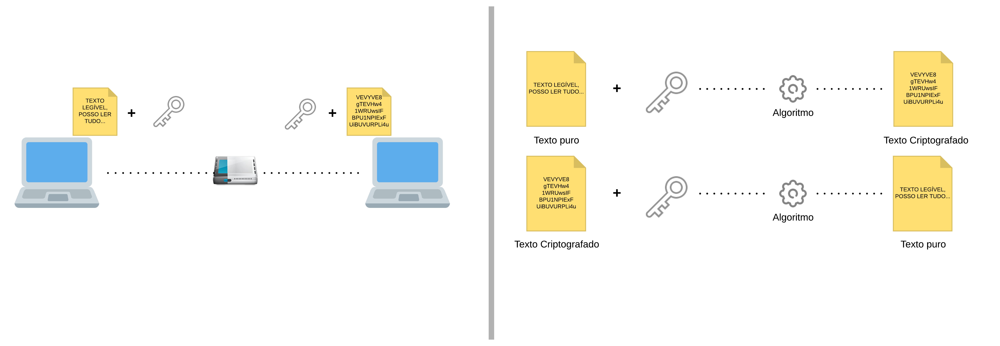
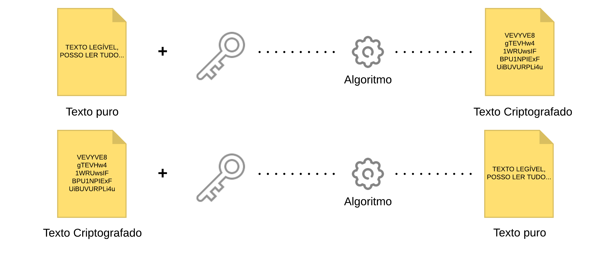

# Sistemas Distribuídos
Segundo Tanenbaum, um sistema distribuído é um conjunto de computadores independentes entre si (e até diferentes), ligados através de uma rede de dados, que se apresentam aos utilizadores como um sistema único e coerente.
## Exemplos:
- Sistemas de pesquisas (motores de busca)
- Sistemas financeiros
- Jogos Online
- Redes Sociais e plataformas idênticas

# Cluster
### O que é cluster?
Cluster (ou clustering) é, em poucas palavras, o nome dado a um sistema que relaciona dois ou mais computadores para que estes trabalhem de maneira conjunta no intuito de processar uma tarefa. Estas máquinas dividem entre si as atividades de processamento e executam este trabalho de maneira simultânea.

Cada computador que faz parte do cluster recebe o nome de nó (ou node). Teoricamente, não há limite máximo de nós, mas independentemente da quantidade de máquinas que o compõe, o cluster deve ser "transparente", ou seja, ser visto pelo usuário ou por outro sistema que necessita deste processamento como um único computador.

Os nós do cluster devem ser interconectados, preferencialmente, por uma tecnologia de rede conhecida, para fins de manutenção e controle de custos, como a Ethernet. É extremamente importante que o padrão adotado permita a inclusão ou a retirada de nós com o cluster em funcionamento, do contrário, o trabalho de remoção e substituição de um computador que apresenta problemas, por exemplo, faria a aplicação como um todo parar.

[Infowester](https://www.infowester.com/cluster.php)

# Cluster Beowulf

O Beowulf não é, necessariamente, um middleware, como muitas pensam. Na verdade, este nome faz referência a um padrão de clustering disponibilizado pela NASA (National Aeronautics and Space ) em 1994 e amplamente adotado desde então.

Originalmente, Beowulf é o nome de um poema extenso e bastante antigo, cujo manuscrito foi encontrado no século XI. A obra descreve os atos de um herói de mesmo nome que se destaca por sua força descomunal e que, portanto, enfrenta um perigoso monstro para salvar um reino. A história serviu de inspiração para que os pesquisadores Thomas Sterling e Donald Becker, da NASA, batizassem o projeto de cluster no qual trabalhavam de Beowulf.

Um cluster Beowulf se define, basicamente, pela ênfase nas seguintes características:

- Entre os nós, deve haver pelo menos um que atue como mestre para exercer o controle dos demais. As máquinas mestres são chamadas de front-end; as demais, de back-end. Há a possibilidade de existir mais de um nó no front-end para que cada um realize tarefas específicas, como monitoramento, por exemplo;

- a comunicação entre os nós pode ser feita por redes do tipo Ethernet, mais comuns e mais baratas, como você já sabe;

- Não é necessário o uso de hardware exigente, nem específico. A ideia é a de se aproveitar componentes que possam ser encontrados facilmente. Até mesmo PCs considerados obsoletos podem ser utilizá-los;

- O sistema operacional deve ser de código aberto, razão pela qual o Linux e outras variações do Unix são bastante utilizados em cluster Beowulf. O MOSIX, a ser abordado no próximo tópico, é uma opção bastante usada para este fim;

- Os nós devem se dedicar exclusivamente ao cluster;

- Deve-se fazer uso de uma biblioteca de comunicação apropriada, como a PVM (Parallel Virtual Machine) ou a MPI (Message Passing Interface). Ambas são direcionadas à troca de mensagens entre os nós, mas o MPI pode ser considerado mais avançado que o PVM, uma vez que consegue trabalhar com comunicação para todos os computadores ou para apenas um determinado grupo.

[Infowester](https://www.infowester.com/cluster.php)

## Cluster Computer - MapReduce
Arquitetura e estruturação do sistema - Cluster de processamento de texto em grandes volumes (BigData), modelo mapReduce - WordCount example.

## Segurança
		
Para gerenciar os arquivos entre cada node do cluster, será utilizado a criptpgrafia em base64¹ e um método de compactação **hash_string** para garantir segurança e menores quantidades de dados trafegando na rede via sockets, possibilitando uma comunicação mais rápido de node à node.

	¹Base64 é um método para codificação de dados para transferência na Internet (codificação MIME para 
	transferência de conteúdo). É utilizado frequentemente para transmitir dados binários por meios de
	transmissão que lidam apenas com texto, como por exemplo para enviar arquivos anexos por e-mail.
	[Wikipédia]- https://pt.wikipedia.org/wiki/Base64

Foi utilizado o conceito de criptografia ponto à ponto bastante conhecido graças aos mensageiros com o Whatsapp, onde a criptografia e decriptografia acontece em ambos os nós de uma conexão.
### Representação do sistema de criptografia utilizado no Cluster
[1]
[1]

## Arquitetura geral do Sistema Cluster

